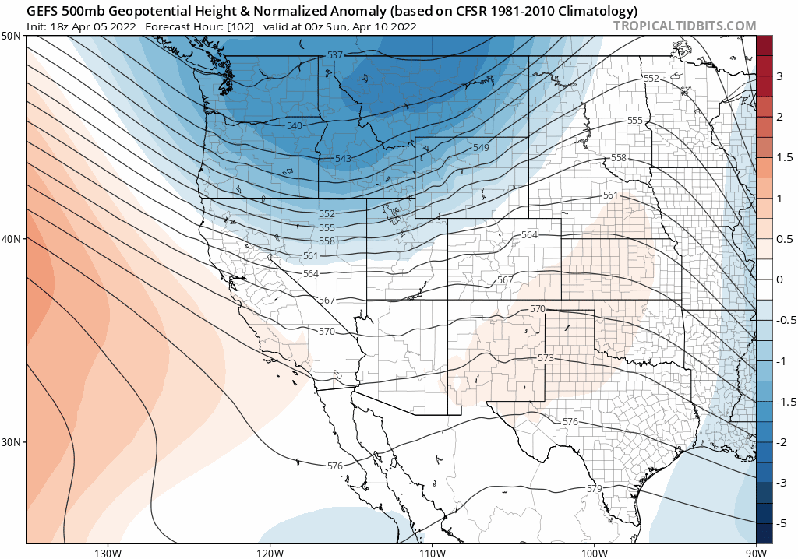
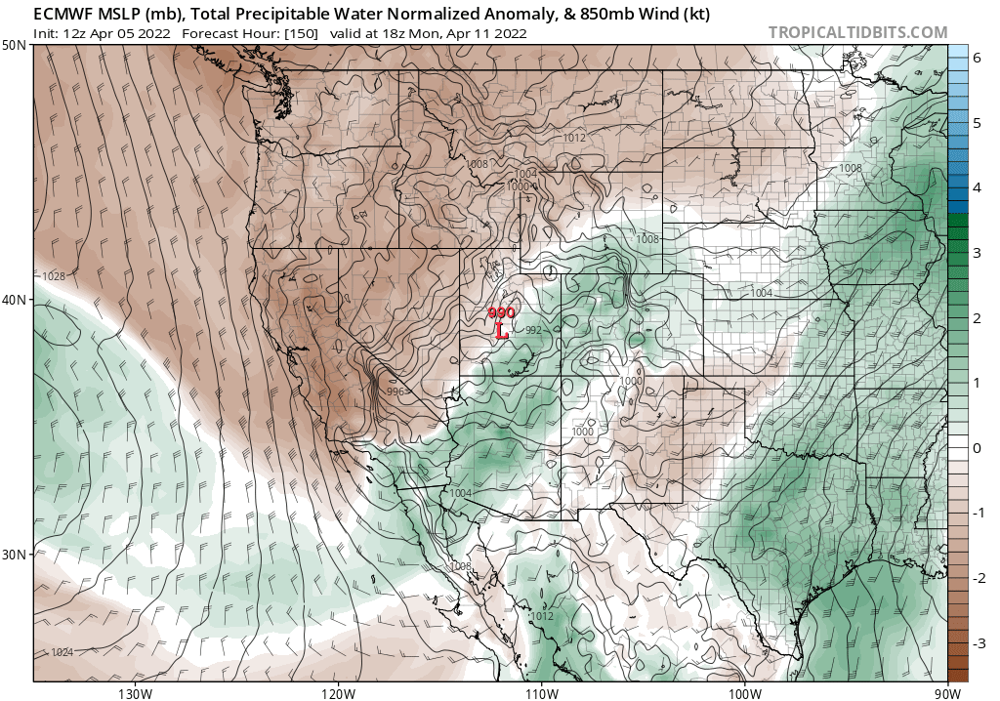

  #Another Aprii Cycle is coming. 
A low pressure system is pushing down into Utah. There isn't much water in the system, but modles are showing a bit more water coming into the equation from the Pacific. Right now it is looking a little bit more optimistic for higher snow totals. 
  
 
