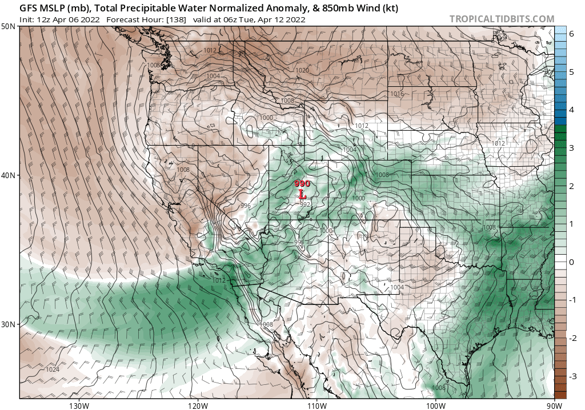

# tntWeather
## Daily Snow
As we get closer to the actual storm cycle, I can see some advances in the storm’s potential strength. I am hoping this cycle is on the higher end of snow totals, but I could see it going either way. The total percipitable water just keeps going up for April 11th - 13th. My predicted snow totals just keep going up in my mind. 

2022-04-06 14:49:10 Wednesday

# Archive:
[04/04/2022](04-04-2022.md)
